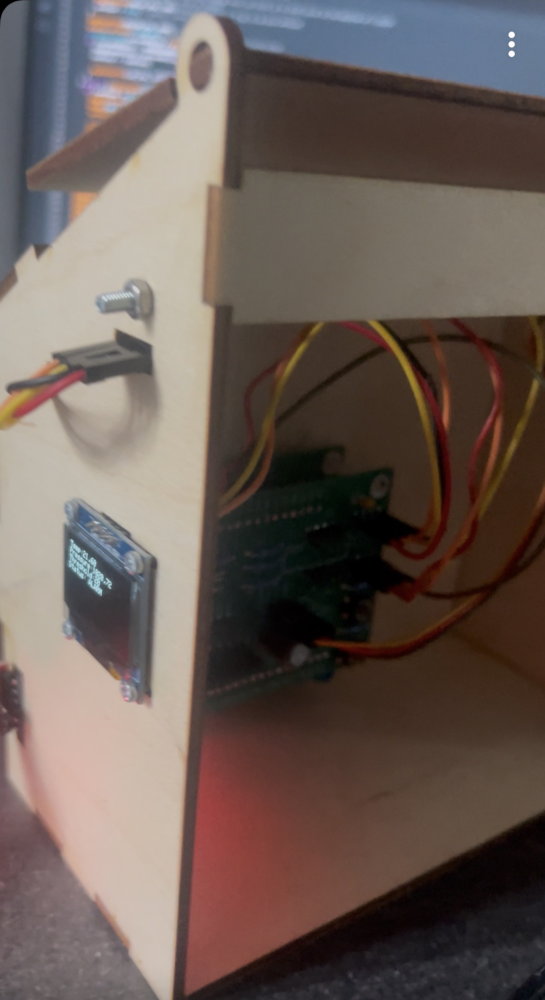
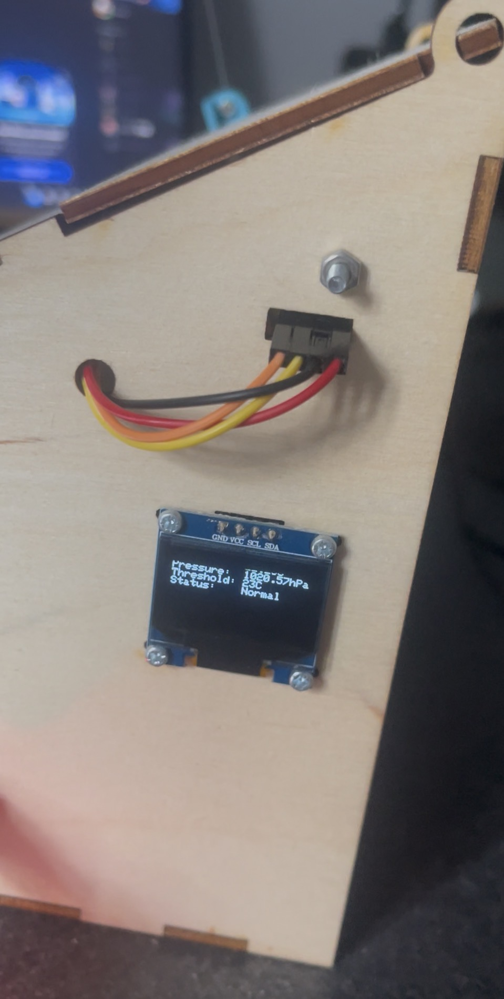
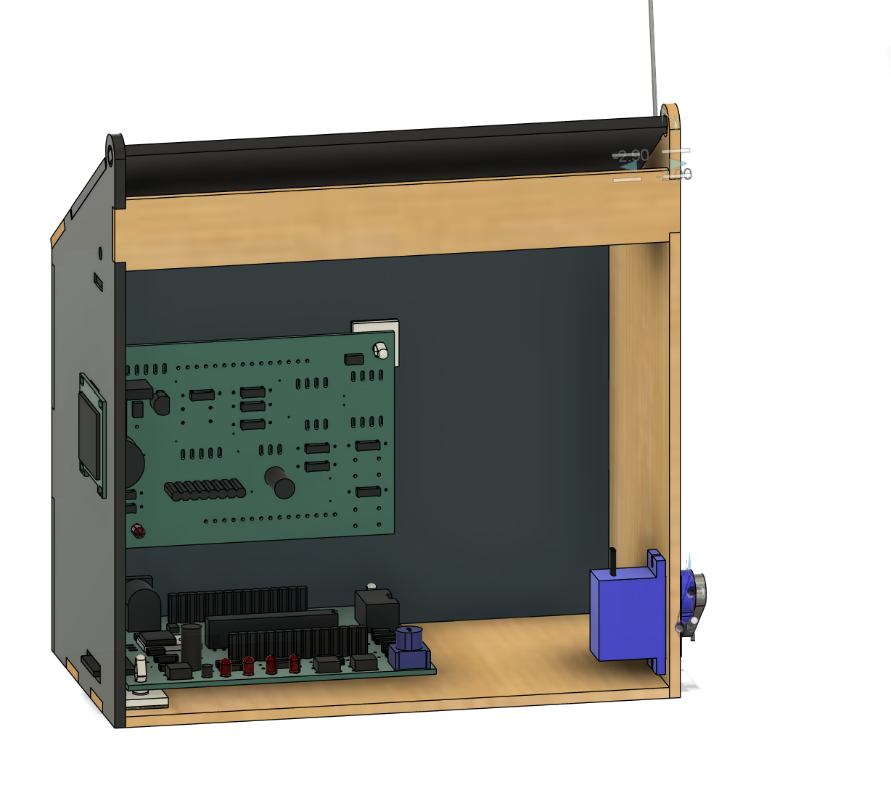

# Automated-greenhouse-temperature-control-system

An embedded greenhouse monitoring and ventilation system combining a custom PCB, BMP180 environmental sensor, embedded C++ firmware and servo-actuated window mechanism.

The system continuously monitors temperature and atmospheric pressure while allowing the user to set an adjustable 20–35°C temperature threshold using an onboard potentiometer.When the measured temperature exceeds the selected threshold,the controller automatically opens the ventilation window and activates visual and audible warning indicators.

### Front View

### Side View

## CAD Front view

