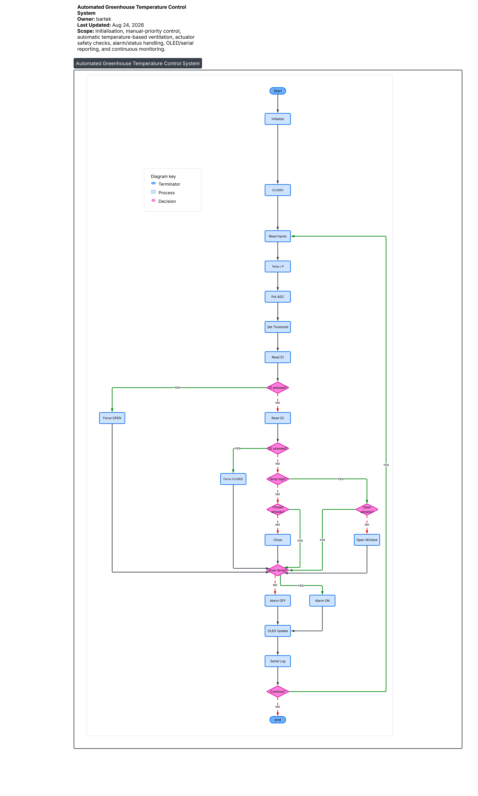

## Firmware:

The control firmware was written in C++ using the arduino framework and integrates the sensor, user controls, display,alarms and window actuator

### Firmware performs:

Reads temperature and atmospheric pressure from the BMP180 sensor over I²C
Samples the onboard potentiometer using the MCU's ADC
Maps the potentiomter reading to a user adjustable 20 - 35C temperature threshold
Compared ther measured temperature against the selected threshold to control greenhouse ventilation
Controls an SG90 servo motor to open and close the window
Uses a relay to supply powert to the servo only during movement, reducing idle poower consumption and servo jitter
Provides manual open/close through 2 buttons
Displays temperature,pressure,threshold and system staus on a 128x64 SSD1306 OLED
Activates a buzzer and blinking LED during an over temperature condition
Outputs sensor meassurements over 9600 baud serial interface for debugging or testing

### Control logic: Automated Greenhouse Temperature Control System

contol priority: (emergency) S1 pressed = forces window OPEN S2 pressed = forces window CLOSED no buttons = automatic temperature control

temp above threshold = open vent(window) temp below threshold = close vent

The firmware tracks the current ventilation so the servo only activates when a change in window postion is needed.Servo power is supplied through the relay during movement and diconnected once the required servo position is met.
